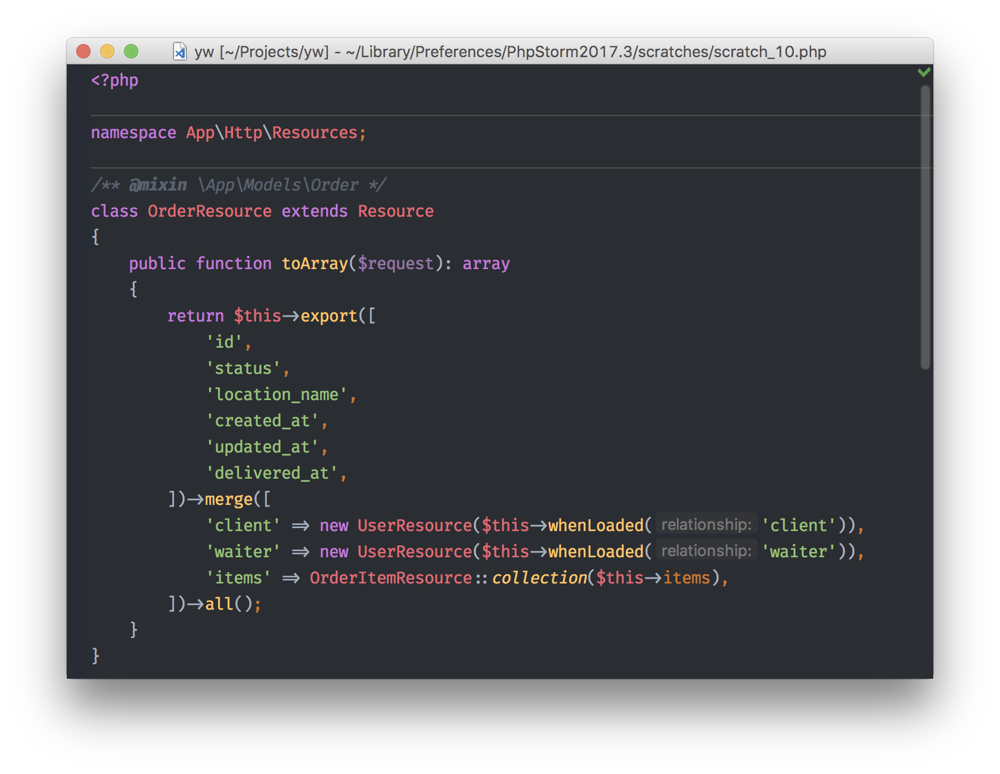

# Exporter: Export the attributes you need from all your objects and arrays.

<a href="https://scrutinizer-ci.com/g/mathieutu/exporter"></img></a>
<a href="https://scrutinizer-ci.com/g/mathieutu/exporter"></img></a>
<a href="https://packagist.org/packages/mathieutu/exporter"></a>
<a href="https://packagist.org/packages/mathieutu/exporter"></a>
<a href="https://packagist.org/packages/mathieutu/exporter"></a>

## Installation

Require this package with composer:
```bash
composer require mathieutu/exporter
```

## Use cases

Because pictures are worth thousands words:

The Exporter package let you write this:

<p align="center">
    <a href="./.github/assets/after.png">
        
    </a>
</p>

instead of that:

<p align="center">
    <a href="./.github/assets/before.png">
        
    </a> 
</p>

For example, I use it a lot with Laravel Eloquent Resources, or as an easier alternative of Symfony Normalizer:

<p align="center">
    <a href="./.github/assets/resource.png">
        
    </a>
</p>

## Usage

Use the `\MathieuTu\Exporter\Exporter` trait on your classes. 
You also can use directly the `\MathieuTu\Exporter\ExporterService::exportFrom($exportable, $attributes)` static method on basic arrays or objects, or if you can't add the trait.

You can export from arrays, objects with `ArrayAccess` interface, or any standard objects.

The response will be a [Laravel Collection](https://laravel.com/docs/collections) (but you absolutely don't need Laravel, **this package is totally framework-agnostic**). 
If you don't know how to use collections, you can **use it exactly like an array**, or use `toArray()` method to get a real one.

### Strict Mode

By default, when you try to export an attribute that doesn't exist, the Exporter will return `null` for that attribute. However, you can enable **strict mode** to throw a `NotFoundException` instead, which helps catch typos and missing attributes during development:

```php
\MathieuTu\Exporter\ExporterService::$strict = true;

$object->export(['foo', 'nonExistentProperty']); 
// Throws: NotFoundException: nonExistentProperty can't be found in {...}
```

This is particularly useful during development to ensure all your exported attributes exist, and can be disabled in production if you prefer more lenient behavior.

### Examples
_(You can find all this examples and more in the [package tests](./tests/ExporterServiceTest.php))_

For the examples, and to cover all the possible ways to use this package, we'll consider this object as input:

```php
$object = new class {
    use \MathieuTu\Exporter\Exporter;

    public $foo = 'testFoo';
    private $bar = ['bar1' => 'testBar1', 'bar2' => 'testBar2', 'bar3' => 'testBar3'];
    public $baz = [
        (object) ['baz1' => 'baz1A', 'baz2' => 'baz2A', 'baz3' => 'baz3A'],
        (object) ['baz1' => 'baz1B', 'baz2' => 'baz2B', 'baz3' => 'baz3B'],
        (object) ['baz1' => 'baz1C', 'baz2' => 'baz2C', 'baz3' => 'baz3C'],
    ];

    public function testWithParam(string $param): string
    {
        return 'test' . $param;
    }

    public function test(): string
    {
        return 'test' . date("l");
    }
    
    public function getBar(): array
    {
        return $this->bar;
    }
};
```

and a standard array as output (in comment), instead of a Collection (result from the `$collection->toArray()` method).


#### Export public and private (with getter) root attributes

```php
$object->export(['foo']); // ['foo' => testFoo]
$object->export(['foo', 'bar']); 
/* 
[
    'foo' => testFoo,
    'bar' => ['bar1' => 'testBar1', 'bar2' => 'testBar2'],
]
*/
```


#### Export from nested array/object

- ##### In an array:

```php
$object->export(['bar' => ['bar2', 'bar3']]);
/* 
[
    'bar' => [
        'bar2' => testBar2',
        'bar3' => testBar3',
    ],
]
*/
```

- ##### Only one attribute:

```php
$object->export(['bar' => 'bar1']); // ['bar' => 'testBar1']
```

- ##### With dot notation:

```php
$object->export(['bar.bar1']); // ['bar.bar1' => 'testBar1']
```

- ##### Using a wildcard to export from lists:

```php
$object->export(['baz' => ['*' => ['baz1', 'baz3']]]); 
/* 
[
    'baz' => [
        ['baz1' => 'baz1A', 'baz3' => 'baz3A'],
        ['baz1' => 'baz1B', 'baz3' => 'baz3B'],
        ['baz1' => 'baz1C', 'baz3' => 'baz3C'],
    ],
]
*/        
```


#### Set an alias as key:

```php
$object->export(['foo', 'bar.bar2 as secondBar']); 
/* 
[
    'foo' => testFoo,
    'secondBar' => 'testBar2',
]
*/
```


#### Export result of a function

```php
$object->export(['testWithParam(Mathieu)']); // ['testWithParam' => testMathieu]
$object->export(['test()']); // ['test' => testFriday]
```


## Complete Example

Here's a comprehensive example that showcases the full power of the Exporter package by combining functions, aliases, nesting, and wildcards:

```php
// Consider a real-world scenario: a blog post with author and comments
$blogPost = new class {
    use \MathieuTu\Exporter\Exporter;

    public int $id = 42;
    public string $title = 'Exporting Complex Data Structures with PHP Exporter';
    public DateTime $publishedAt {
        get => new DateTime('2026-02-15');
    }

    public array $author = [
        'id' => 1,
        'name' => 'Mathieu Tudisco',
        'email' => 'oss@mathieutu.dev',
        'bio' => 'PHP Developer',
    ];

    public array $comments {
        get => [
            (object)['id' => 1, 'author' => 'Alice', 'content' => 'Great article!', 'likes' => 5],
            (object)['id' => 2, 'author' => 'Bob', 'content' => 'Very helpful', 'likes' => 3],
            (object)['id' => 3, 'author' => 'Charlie', 'content' => 'Thanks for sharing', 'likes' => 7],
        ];
    }

        public function getSlug(): string
        {
            return strtolower(str_replace(' ', '-', $this->title));
        }

        public function getExcerpt(): string
        {
            return substr($this->title, 0, 17) . '...';
        }
};

// Export a complete, structured API response with all features combined
$apiResponse = $blogPost->export([
    'id',
    'title',
    'slug',                                       // Automatic getter (getSlug)
    'publishedAt' => 'format(j F Y)',           // Native nested function with parameter
    'excerpt as summary',                         // Automatic getter + alias
    'author as writer' => ['name', 'bio'],        // Nested export with alias on key
    'author' => 'name',                           // Nested export
    'author.email as contact',                    // Nested export with dot notation + alias
    'comments as feedback' => [                   // Collection with alias on key
        '*' => ['author as commenter', 'likes']   // Wildcard + alias on nested attribute
    ],
]);

/* Result:
[
    'id' => 42,
    'title' => 'Exporting Complex Data Structures with PHP Exporter',
    'slug' => 'exporting-complex-data-structures-with-php-exporter',
    'publishedAt' => '15 February 2026',
    'summary' => 'Exporting Complex...',
    'writer' => [
        'name' => 'Mathieu Tudisco',
        'bio' => 'PHP Developer',
    ],
    'author' => 'Mathieu Tudisco',
    'contact' => 'oss@mathieutu.dev',
    'feedback' => [
        ['commenter' => 'Alice', 'likes' => 5],
        ['commenter' => 'Bob', 'likes' => 3],
        ['commenter' => 'Charlie', 'likes' => 7],
    ],
]
*/
```

All these features work seamlessly together, allowing you to transform complex data structures into clean, well-structured responses with minimal code.


### License

This Exporter package is an open-sourced software licensed under the [MIT license](http://opensource.org/licenses/MIT).

### Contributing

Issues and PRs are obviously welcomed and encouraged, both for bugs and new features as well as documentation.
Each piece of code added should be fully tested, but we can do that all together, so please don't be afraid by that. 
